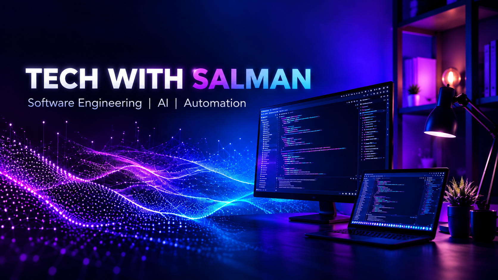

<div align="center">



**Build · Learn · Create · Grow**


<a href="https://techwithsalman.online/">

</a>
<a href="https://github.com/techwithsalman?tab=repositories">

</a>
<a href="https://github.com/techwithsalman?tab=followers">

</a>


<a href="https://github.com/techwithsalman?tab=followers">

</a>

</div>

---

## 01. About Me

```typescript
const salman = {
  role: "Software Developer & UI/UX Designer",
  focus: ["Web Apps", "Desktop Apps", "AI Automation"],
  brand: "Tech With Salman",
  location: "Pakistan"
};
```

I build practical web and desktop tools with a focus on clean interfaces, workflow automation, and useful digital products.

**Open to development and design collaborations.**

---

## 02. Tech Stack

**Languages & Web**


**Apps & Backend**


**Design & Tools**


---

## 03. Featured Projects

**Software Projects & Digital Products**

Building practical tools, automation systems, and modern applications.

<details>
<summary><b>Social Media OS — Multi-platform publishing</b></summary>

A web and desktop project for connected accounts, content publishing, and scheduling.

**Stack:** Next.js · React · TypeScript · Prisma

[Browse public repositories](https://github.com/techwithsalman?tab=repositories)

</details>

<details>
<summary><b>ToolHubPro — Online utility platform</b></summary>

A responsive web platform bringing multiple digital utilities into one place.

**Stack:** Next.js · JavaScript

[Browse public repositories](https://github.com/techwithsalman?tab=repositories)

</details>

<details>
<summary><b>YouTube Uploader — Desktop workflow</b></summary>

An Electron project for managing video upload queues and scheduling workflows.

**Stack:** Electron · Node.js

[Browse public repositories](https://github.com/techwithsalman?tab=repositories)

</details>

<details>
<summary><b>Agnes Video Studio — AI video workflow</b></summary>

A desktop project for organizing AI-assisted video generation tasks.

**Stack:** Electron · React · TypeScript

[Browse public repositories](https://github.com/techwithsalman?tab=repositories)

</details>

<details>
<summary><b>Dola Video Studio — Video task automation</b></summary>

A desktop project for prompt queues and video-generation task management.

**Focus:** Automation · Desktop workflows

[Browse public repositories](https://github.com/techwithsalman?tab=repositories)

</details>

<details>
<summary><b>Universal License System — Desktop licensing</b></summary>

A multi-product project for software licensing and activation workflows.

**Focus:** Electron · License management

[Browse public repositories](https://github.com/techwithsalman?tab=repositories)

</details>

---

## 04. Experience

**Independent Software Developer & Product Builder — Tech With Salman**

Web apps · Electron desktop projects · UI/UX design · API integrations · AI-assisted workflows.

---

<details>
<summary><b>05. Certifications</b></summary>

Verified certifications can be added here with their credential links.

</details>

---

## 06. GitHub Analytics

<div align="center">


</div>

---

## 07. Contribution Activity

[**View my GitHub contribution activity →**](https://github.com/techwithsalman?tab=overview)

---

## 08. Contribution Snake

<div align="center">

**A little purple energy for every contribution.**


<sub>Updated automatically by GitHub Actions</sub>

</div>

---

## 09. Connect

<div align="center">

<a href="https://techwithsalman.online/">

</a>
<a href="https://github.com/techwithsalman">

</a>
<a href="https://www.instagram.com/salmaneditz25/">

</a>

</div>
